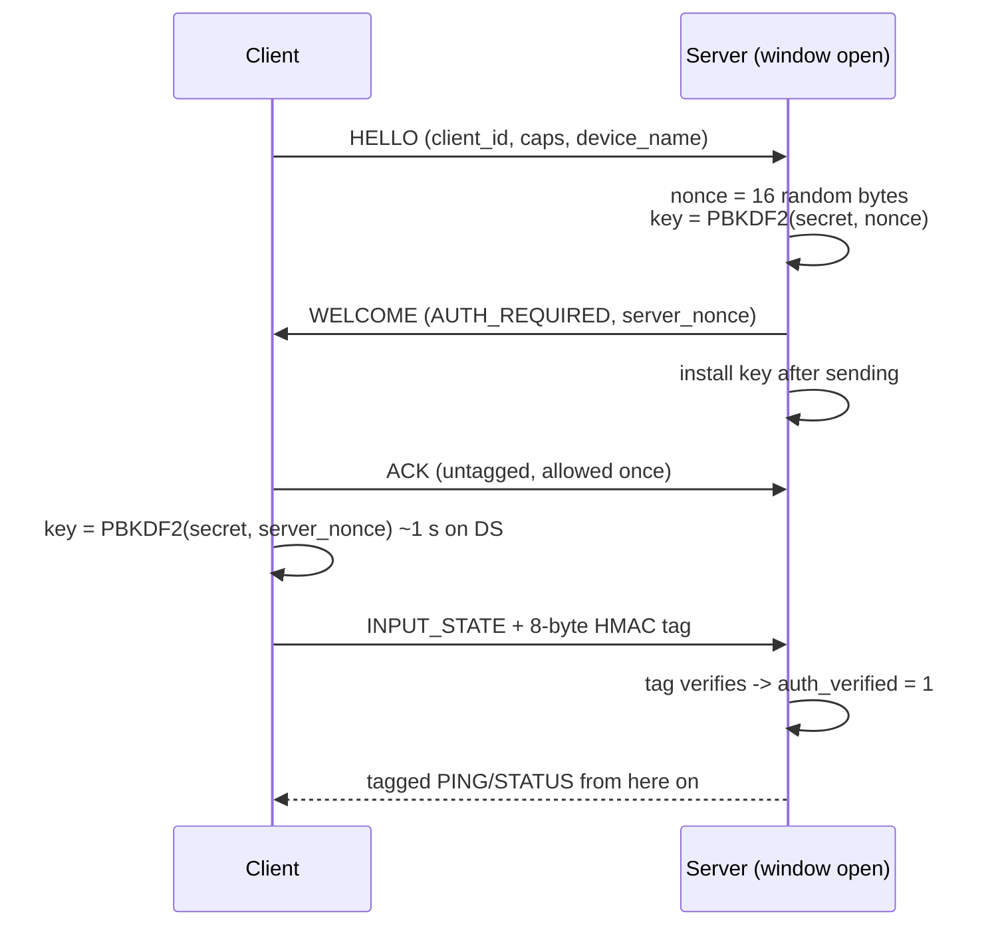

# Pairing: what the code actually does

Written 2026-09-10 to answer three questions precisely: how a connection
without a token is handled, how paired devices are saved, and how an unpaired
device is kept out. The short answers are not the ones the questions assume,
so this document quotes the code. `PROTOCOL.md` §10 is normative; nothing
below disagrees with it.

**The one-paragraph answer.** A connection without a token is the normal
case: whenever no pairing window is open, the server issues a plain,
unauthenticated `WELCOME` to any `HELLO` it receives, and that device drives a
virtual gamepad. Nobody saves paired devices — the server keeps no list, and
the clients that persist anything keep the server's *address*, never the
secret. An
unpaired device is refused only while a pairing window is open, and only for
the sessions that window covers: inside it, a datagram without a valid tag is
dropped, a wrong key costs one of five attempts, and sessions that never
proved a key are torn down when the window closes. Outside a window nothing
is refused, by design; `README.md` ("Security, stated plainly") and the
server's own startup banner already say so.

## 1. The server has two states

The pairing window is a 120 s timer with a secret attached
(`APAD_PAIRING_WINDOW_MS`, `PROTOCOL.md` §11). Everything else follows
from whether it is running.

| | Window closed (default) | Window open |
|---|---|---|
| How you get here | server start; window expired; five failed attempts do **not** close it, they rotate the secret | web UI **Pair** → `POST /api/pair/begin?kind=pin\|token` (`server/host/common/webui.h:853`); headless Linux `kill -USR1 <pid>` (`-USR2` cancels) ; library call `apad_server_begin_pairing()` |
| `ANNOUNCE.pairing_required` | 0 | 1 (`server/src/server.c:837`, from `apad_pairing_is_open()`, `server/src/pairing.c:270`) |
| What a `HELLO` gets | `WELCOME` with `flags = 0`, no nonce, no key — an unauthenticated session for its whole life (`handle_hello`, the `else` branch after `server/src/server.c:1048`) | `WELCOME` with `AUTH_REQUIRED` and a fresh 16-byte `server_nonce`; the server derives the key from the window's secret and installs it only *after* the `WELCOME` is sent (`server/src/server.c:1048-1097`), logging "needs a PIN to finish connecting" |
| What the product tells you | startup banner: "devices can connect without a PIN. To require one, open AtticPad in your browser and choose Pair" (`server/host/linux/main.c:578`); web UI: "Any device on your network can connect. Pair with a PIN to require one." (`server/host/common/assets.h:408`) | the PIN or the QR is on screen for 120 s |

There is no third state. No option makes the server refuse a `HELLO` outside
a window, and `apadserver.h`'s header lists "any persistent record of a
previously-paired client" as deliberately out of scope.

## 2. Connecting without a token

**Window closed.** The client engine (`clients/common/apad_client.c`) sends
`HELLO`, receives a `WELCOME` without `AUTH_REQUIRED`, and goes straight to
ACTIVE. No secret is asked for and none would be used. This is what every
client does at every boot on a server that has not been told to pair, and it
is how the DS, 3DS, PSP and Android clients were tested most of the time.

**Window open, no secret held.** Two things stop the client, in order:

1. *Before the handshake.* `apad_client_probe()` sends a unicast `DISCOVER`
   and reads `pairing_required` out of the `ANNOUNCE` into the stats
   snapshot (`clients/common/apad_client.h:139`). The 3DS and DS connect
   screens check it and, with no secret in hand, show "server requires
   pairing" and offer ENTER PIN or the QR scanner instead of connecting
   (`clients/3ds/source/screen_connect.c` around line 235, DS the same).
2. *Inside the handshake* (if the probe was skipped, or the window opened in
   between). The `WELCOME` arrives with `AUTH_REQUIRED`. The engine ACKs it
   immediately — §10 allows that one `ACK` to be untagged, and §10.2 requires
   it to be sent before any key derivation, because PBKDF2 takes about a
   second on the DS and the `WELCOME` retransmit schedule would expire
   first. With no secret to derive from it sets
   `APAD_AUTH_NEED_SECRET` (`apad_client.c:985`), closes the session locally
   without a `BYE` (a `BYE` would need a tag it cannot make), and
   `apad_client_connect()` returns `APAD_ERR_AUTH` (`apad_client.c:1621`).
   The server reaps the slot after the 3 s idle timeout. The UI then says
   "server asked for a pairing key" and the user types the PIN or scans.

That untagged `ACK` is the only unauthenticated datagram the server will ever
act on for an `AUTH_REQUIRED` session (`check_auth`,
`server/src/server.c:1758`). Everything else without a valid tag is dropped
silently — no `ERROR` is sent back, because answering a 125 Hz input stream
with errors would be an amplifier.

## 3. Connecting with a PIN or a token

- Both sides run the same derivation:
  `PBKDF2-HMAC-SHA256(secret, server_nonce, 10000 iterations, 32 bytes)`
  (`apad_derive_session_key`, `core/src/hmac_sha256.c:386`). The client
  side is `apad_client.c:995`, then `apad_session_set_key` and
  `APAD_AUTH_KEYED` (`apad_client.c:1001`).
- The nonce is per **session**, not per window: two clients pairing off the
  same PIN get different keys, so neither can read or forge the other's
  traffic. It also means nothing can be precomputed before the `WELCOME`
  lands.
- Every datagram after `WELCOME` carries an 8-byte truncated HMAC-SHA256 tag
  over the whole datagram, compared in constant time.
- A **PIN** is six digits, typed. A **token** is at least 16 characters from
  a 32-symbol alphabet with no look-alike glyphs, normally scanned from the
  server's QR as `atticpad://<ip>:<port>/?v=1&s=<secret>` (§10.3, parsed by
  `apad_pair_uri_parse()` in `core/`; the DS and 3DS feed it from
  `clients/common/apad_qr.c`). Same derivation, very different entropy: a
  captured handshake lets an attacker brute-force a six-digit PIN offline;
  it does not let them search an 80-bit token. The secret itself never
  appears on the wire in either case.
- One secret serves the whole window. It is not consumed by a successful
  pairing; several devices can pair off the same PIN or QR within the 120 s.

## 4. What "saved" actually means

| Side | Persisted | Never persisted | Where |
|---|---|---|---|
| Nintendo DS/DSi | last server address and port, last network's SSID, security type and Wi-Fi key | the pairing PIN or token | `clients/nds/source/config_nds.h`: "the address this console last reached ACTIVE with is persisted, and THE PAIRING PIN NEVER IS ... a secret that survives a power cycle on removable media is not a secret with the properties §10 assumes" |
| Nintendo 3DS | last server address and port | the secret | `clients/3ds/source/config_3ds.h`: "MIRRORS ANDROID'S POLICY EXACTLY: the last-connected address is persisted, the pairing PIN/key never is" |
| Android | `last_ip` in SharedPreferences | the secret | `MainActivity.kt` ~1630: "NOT persisted ... it would outlive by weeks a window whose whole security argument is that it lasts two minutes" |
| PSP | nothing — no config file; the address is typed each run | the secret | `clients/psp/source/` has no config module |
| Server | nothing about devices. Profiles are the only saved state and they match on `device_name`, not identity | any trusted-device list, any per-device key | `server/include/apadserver.h` header: "nothing here remembers a device across sessions. Every session inside a window derives its own key from the PIN the user is looking at." |

Two consequences:

- **A PIN is per session, not per device.** After a reboot, or after the
  3 s idle timeout drops the session, the user types or scans again *if a
  window is open* — and connects with nothing at all if it is not.
- **`HELLO.client_id` is not what §6.3 says it is.** The wire field reads
  "persistent, random at first run, identifies a paired device". The engine
  fills it with 16 bytes seeded from the millisecond clock at
  `apad_client_create()` (`apad_client.c:1386-1394`, "stable enough to
  identify this session"), no client stores it, and the server never reads
  it. `PORTING.md` records this as an engine gap ("§6.3 persistence is
  unsatisfiable until the engine grows it"). `WELCOME.key_material`, the 32
  bytes reserved for a long-term key, is zero in v1 as §6.4 requires.

## 5. How an unpaired device is refused, and when it is not

Inside a window, for a session that was issued `AUTH_REQUIRED`
(`check_auth`, `server/src/server.c:1758-1857`):

- A datagram with no tag is **dropped silently** — the `WELCOME`-discharging
  `ACK` excepted. It does not refresh liveness, so a session that never
  proves its key dies at the 3 s idle timeout.
- A datagram whose tag **fails to verify** gets `ERROR` code 3
  (`APAD_ERRC_AUTH_FAILED`) and the session is torn down. The first wrong
  tag on a session charges one pairing attempt (`apad_pairing_fail`,
  `server/src/pairing.c:303`); the fifth failure against the current secret
  **regenerates the secret** without extending the deadline. Failures
  against an older, already-rotated secret are not counted.
- When the window **closes** — 120 s elapsed, or cancelled —
  `drop_unproven_sessions()` (`server/src/server.c:1725`) tears down every
  session that was issued `AUTH_REQUIRED` and never verified a tag. Sessions
  that did verify are left alone: they are paired for as long as they live.
- A window that cannot get entropy for a nonce refuses the `HELLO` with
  `ERROR` code 4 (`APAD_ERRC_PAIRING_CLOSED`) and closes itself rather than
  issue a key it cannot salt.

The client sees these as `APAD_AUTH_FAILED` in the engine's auth state
(`apad_client.c:1180`, on `ERROR` 3, and `apad_client.c:181` when an
`AUTH_REQUIRED` session ends with no tag ever verified — so a wrong PIN is
reported even when the server said nothing) and as "server rejected the
scanned key" or "wrong PIN" on screen.

**Outside a window, none of this runs.** The `HELLO` takes the `else` branch,
the session is unauthenticated, and the refusal machinery never engages.
That is the design, and `PROTOCOL.md` §10.3 states the threat model:
what protects you is the bounded window, the five-attempt limit and
LAN-only binding, together making the realistic attack "be on the network
during the two-minute window and guess within five tries" — a model that
"stops a housemate, not an adversary". On the open or WEP networks the DS
requires, anyone in range is on the network.

## 6. Closing the gap — design notes, not built

Two pieces would make the questions this document answers true in the way
they were asked. Neither exists; both are sketched here so the shape is on
record. `DESIGN.md` §5.10 lists the second as "Not implemented as of 0.5.0".

**a. A "require pairing" server mode.** A host option (CLI flag plus a web-UI
toggle, persisted in the host's settings) under which `handle_hello` refuses
a `HELLO` outside a window with `ERROR` code 4 (`APAD_ERRC_PAIRING_CLOSED`)
instead of issuing a plain `WELCOME`. `ANNOUNCE.pairing_required` would
report 1 whenever the mode is on, so clients prompt before dialling. This is
host and server-library code only: no wire change, no client change. Its
cost is that, until (b) exists, every device pairs every session, so it is a
switch for people who want the lock more than the convenience.

**b. A trusted-device store.** The server persists
`(client_id, wrapped long-term key, device_name, first seen, last seen)` and
honours a `HELLO` from a known `client_id` without a window; the engine
generates a real random `client_id` once and persists it (the gap
`PORTING.md` names), keeps a per-server long-term key, and
`WELCOME.key_material` carries that key wrapped (DESIGN.md §5.10's reserved
"forward path", ChaCha20 suggested there) behind a capability bit so v1
clients keep working. Three things to settle before anyone writes it:

- It is a wire-visible change in behaviour even though no offset moves, so
  per `CONVENTIONS.md` it is raised as a v2 capability, not slipped in.
- A long-term key on the client needs the same care the PIN got: the DS and
  3DS configs are plain text on removable SD cards, which is exactly why the
  secret is not written there today. Something must be different about a
  key that *is* written — at minimum, revocation from the server's list must
  be one click, and the docs must say what an SD card in the wrong hands
  means.
- The web UI needs a device list with forget/revoke, and the profile store
  should key on the same identity so a renamed device keeps its mapping.

What does **not** need any of this: remembering the server's address
(already done on every client), and preferring that server in discovery
(done 2026-09-10).

## Pointers

- `PROTOCOL.md` §6.2 (`pairing_required`), §6.3 (`client_id`), §6.4
  (`key_material`), §8 (handshake), §10–§10.3 (authentication, secret
  lengths, derive-after-ACK, pairing URI, threat model), §11 (limits).
- `DESIGN.md` §5.10 (security), D3 (why 10,000 iterations).
- Server: `server/src/pairing.c` (window, attempts, rotation),
  `server/src/server.c` — `handle_hello`, `check_auth`,
  `drop_unproven_sessions`; hosts: `server/host/common/webui.h` (pair
  endpoints), `server/host/linux/main.c` (signals, banner).
- Client engine: `clients/common/apad_client.c` (auth states, derive after
  ACK, `APAD_ERR_AUTH`); QR: `clients/common/apad_qr.c`.
- Core: `core/src/hmac_sha256.c` (`apad_derive_session_key`,
  `apad_pbkdf2_sha256`), `core/src/session.c` (`apad_session_set_key`).
- Client persistence policy: `clients/nds/source/config_nds.h`,
  `clients/3ds/source/config_3ds.h`,
  `clients/android/app/src/main/java/net/atticpad/MainActivity.kt`.
